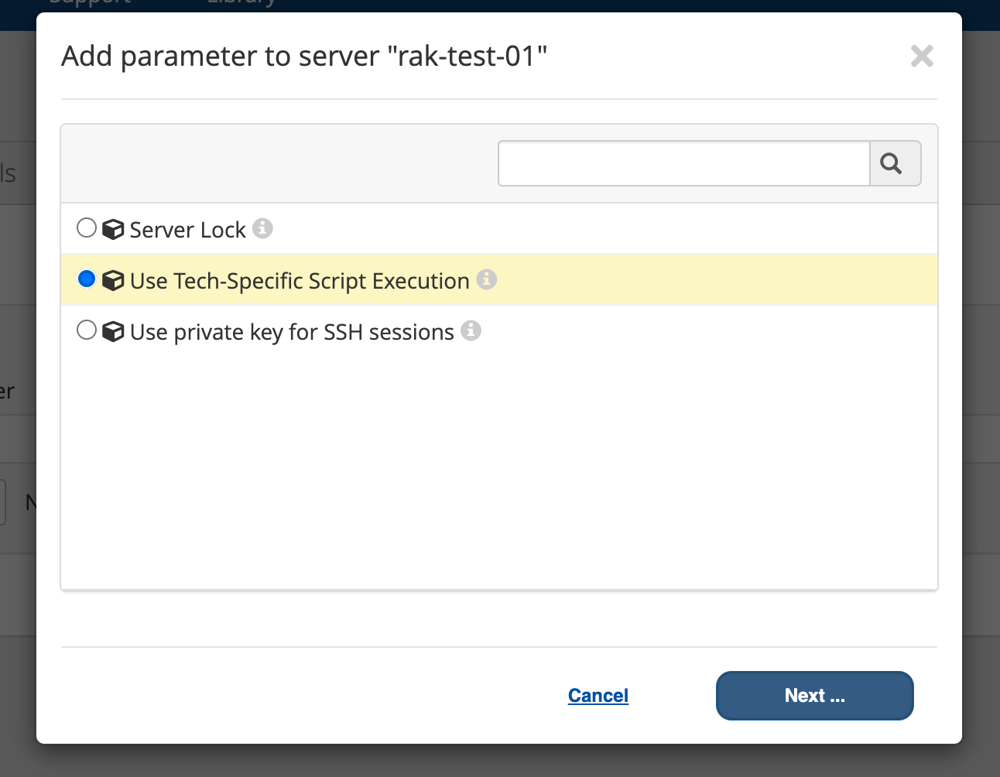

# Remote Script Execution

* A key element in orchestration the deployment of resources across any cloud is the ability to run remote scripts on newly provisioned resources.
* Remote scripts can be used to install software, configure the operating systems, even call other automation tools.

## Credential Management
* We previously discussed setting credentials on the images and templates
* These credentials play a role in being able to execute remote scripts against resources both during and after provisioning
* Credentials can also be set on a previously provisioned or discovered Server

## Network Line-of-Sight
* The most critical component to executing remote scripts on target Servers is network connectivity, which is often referred to as network line-of-sight.
* Two channels of remote execution are available: SSH and Tech-Specific

## SSH Remote Execution
* To execute scripts on remote Servers via SSH, CloudBolt CMP must be able to connect directly to the target Server via the network. 
* This can complicate remote script execution on Servers in in public cloud environments due to the fact they often utilize NAT'ed private IPs.
  * Many customers have VPNs or direct connect to the cloud to remove this limitation
* Testing this connectivity is simple -- try to connect via SSH from the CB CMP CLI to the target server.
  * Can also test by executing an Ad-Hoc script from the Server Details pages
* With the exception of the VMware vSphere Resource Handler, all Resource Handlers default to SSH Remote Execution.

## Tech-Specific Remote Execution
* This execution channel is provided by the Resource Handler and leverages the Hypervisor manager or Cloud provider to manage the execution of script on a remote server.
* Tech-specific Remote Execution is currently only supported for the vCenter and AWS Resource Handlers. 
    * It is the default form of execution for vCenter.
* Doesn't require network line-of-sight between CloudBolt CMP and the target Server
* Useful when automating tasks on VMs that are on isolated networks or no network at all
* Can be disabled in which case CloudBolt CMP will revert to remote script execution via SSH.
* Controlled via a boolean parameter to the Server called "Use Tech-Specific Script Execution"
    
* vCenter supports remote execution via its API using VM Tools installed on its Guests' operating systems.
  * This means a Server managed by a connected vCenter need not have a connected network to execute remote scripts on behalf of CloudBolt CMP.
* AWS supports tech-specific execution, but in order for it to work, VMs must be running the SSM (AWS Systems Manager) agent. Fortunately most AWS Marketplace images ship with this agent pre-installed.

## Remote Scripting as part of Provisioning

* In the course of automating Server deployments, it often becomes necessary to execute script prior to the VM being connected to the network
* For instance, a Windows image might not ship with Remote Powershell Scripting enabled which leads to a chicken and the egg problem.
* In order to enable remote scripting, one must be able to run a remote script
* Fortunately most clouds and hypervisor managers support user data that can be used to execute scripts as part of the initial provisioning process.
* Ideal for scenarios where Remote Execution is never available yet images/templates must be configured with scripts.
* We'll revisit this topic later when we cover Orchestration Actions

