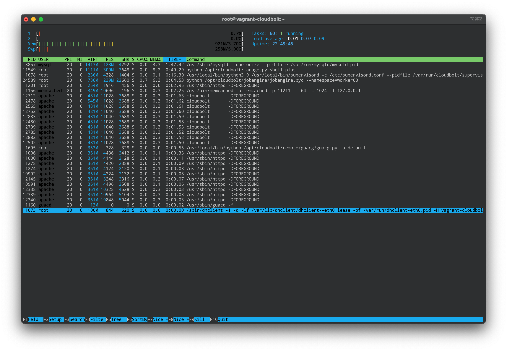

# Useful CLI Commands

## Included on the CMP Appliance by Default
### `htop`
https://htop.dev/

A colorful and customizable interactive process viewer.

Use the following command to show CloudBolt processes (Press `H` after htop starts to hide user threads):

`htop -sH -p $(pgrep -d',' -f /usr/local/bin/python\|httpd\|mysql\|memcached\|guacd\|cloudbolt)`



### `tmux`
https://github.com/tmux/tmux/wiki

Terminal multiplexer that allows multiple terminals on a remote system to be controlled from a single screen. Also supports detachment for later attachment.

Here's a good initial `tmux` setup that can be saved to `~/.tmux.conf`:

```
# remap prefix from 'C-b' to 'C-a'
unbind C-b
set-option -g prefix C-a
bind-key C-a send-prefix

# split panes using | and -
bind | split-window -h
bind - split-window -v
unbind '"'
unbind %

# vim-like pane resizing  
bind -r C-k resize-pane -U
bind -r C-j resize-pane -D
bind -r C-h resize-pane -L
bind -r C-l resize-pane -R

# vim-like pane switching
bind -r k select-pane -U 
bind -r j select-pane -D 
bind -r h select-pane -L 
bind -r l select-pane -R 
```

### `wget`
https://www.gnu.org/software/wget

A non-interactive network downloader similar to, but arguably simpler than, cURL.

```
wget https://downloads.cloudbolt.io/cloudbolt-upgrader-latest.tgz
```
### `openssl`
Great for debugging connections to SSL protected resources/URLs.

```
openssl s_client -connect <IP>:<PORT>
```

## Available via `yum install`

### `netcat`
https://www.commandlinux.com/man-page/man1/nc.1.html

AKA: the Swiss army knife for TCP/IP and great for debugging connectivity to/from the CloudBolt appliance and other systems.


