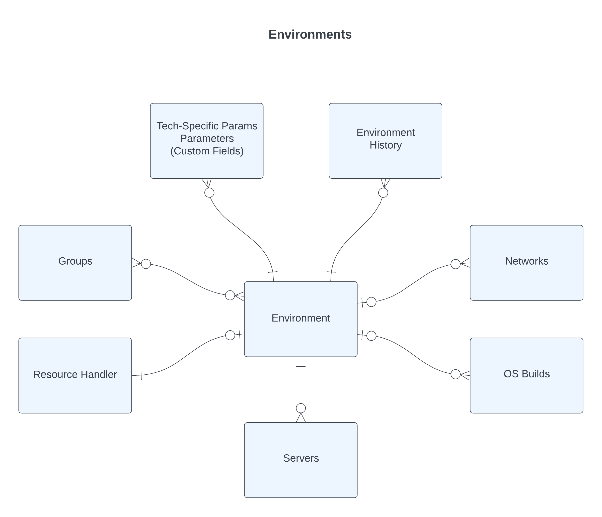

# Environments

* Environments (`infrastructure.models.Environment`) represent a slice of a Public Cloud or data center that is provided and managed by CloudBolt Admins
  *  Can be thought of a logical cloud carved out from an underlying cloud or hypervisor environments
* Environments and their names are exposed to end-users
* Provide a target for new Resources
* Encapsulate details of underlying cloud so users don't have to know them
  * Images and Templates
  * Virtual Networks and Subnets
  * Resource Groups
  * Much more!
* Organization of environments is left up to the CloudBolt Admin
  * By location
  * By cloud
  * By system lifecycle (test, stage, production)
* This flexibility makes it easy to deploy CloudBolt CMP in most customer environments
* Access to Environments is controlled via Groups
  * This allows customers to create Environments dedicated to specific teams/projects
  * By default, new Environments have no groups assigned, therefore no one has access
* Each Environment is association with one and only one Resource Handler, sometimes referred to as the backing technology/cloud
* Hardware, cost, and server count limits can be enforced on any Environment
* CloudBolt Admins can also control what Networks and OS Builds are available to any given Environment

