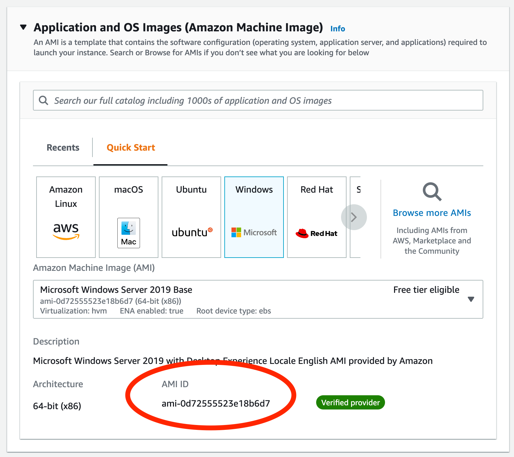

# Images and Templates
* Directly related to the resource handler
* The provider may have different terms, but they serve the same purpose:
    * vCenter = Template
    * AWS = AMI
    * Azure = Image
* Provide base-level operating system images for deployment via compute services

## Importing Templates/Images 

### AWS AMIs
* AMIs in Amazon are region dependent
* Sometimes faster to get AMI IDs from OS vendor
  * https://www.centos.org/download/aws-images/
* The AWS API doesn't provide metadata on the Operating System in an AMI, so CloudBolt CMP will attempt to guess by the name
* Can also get an AMI ID from AWS Console
  * Go to EC2 service console
  * Make sure you're in your target region
  * Click "Launch Instance"
  * Under "Application and OS Images (Amazon Machine Image)" you can find your AMI and the AMI ID is displayed. 
  

### Azure Images
* Images are shared across multiple regions, but must be imported by region to CloudBolt CMP.
* The Azure image database is populated by a CloudBolt Rule that is enabled with an Azure Resource Handler is added.
    * "Fetch and Cache Available Azure Images"
    * To force this process to run, go to `Admin > Rules ` and click the RUN button.
* The fastest way to get images into your Azure Resource Handler is to add them manually

### vCenter Templates
* vCenter templates are created and managed directly by vCenter server
* Can be imported from vCenter Content Library
* Imported templates contain OS info, so they map directly to CloudBolt OS Family

## Image Credentials
* A username and password/private key can associated with any template or image imported
* These credentials should correspond to the default credentials in an image upon provisioning
* Most customers bake their private images with default credentials
* Public clouds often provide mechanisms to apply credentials as part of provisioning
  * Azure can set a username/password as part of provisioning
  * AWS uses a pre-set username (ec2-user, centos) and a Key Pair
* A provided private key overrides any password whether specified or not
* Default image credentials play a large role in remote script execution later

