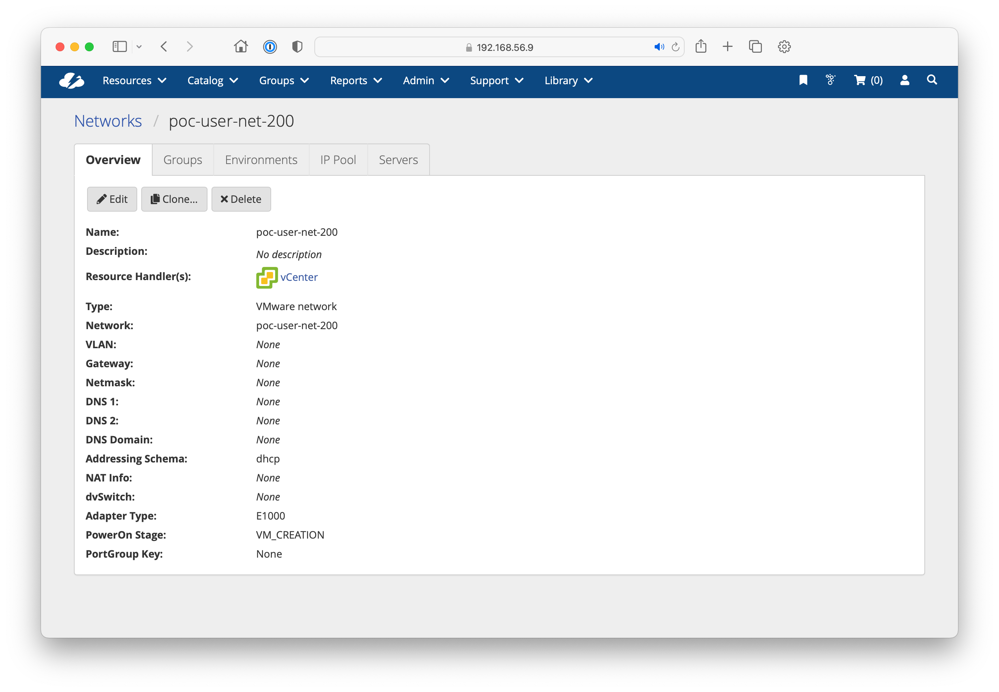
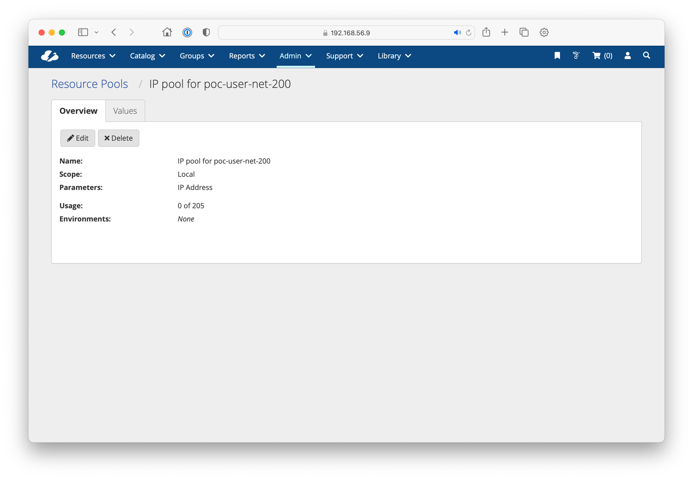

# Networks

* CloudBolt Networks correspond to the ResourceNetwork Python object and are used to represent subnets within a Resource Handler
  * Azure: Subnets
  * AWS: Subnets
  * vCenter: Port Groups
* If a network addressing schema is specified as "dhcp", CloudBolt will rely on the backing network to provide an IP address.
* When set to static, CloudBolt will prompt for an IP address
  * NOTE: most public clouds provide dynamic addressing. When a static IP is needed, it's often provided as a secondary external address.

## IP Pools
In situations where dynamic addressing is not available, static IP addresses can be assigned from a pool of static IP addresses. This will usually apply to data center environments running vCenter.

