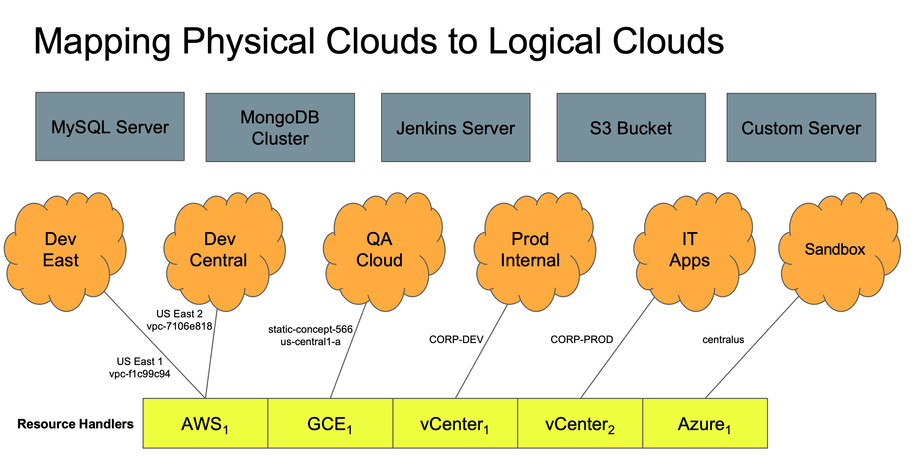

# Resource Handlers

Resource Handlers model the connection between CloudBolt CMP and backend clouds and hypervisor management systems. CloudBolt supports over twenty different Resource Handlers including the most popular AMIGO (AWS, MS Azure, IBM, GCP, & Oracle) clouds and data center hypervisor management systems like vCenter, OpenStack, and Nutanix Acropolis.

As the mediator between backend providers, CloudBolt Resource Handlers serve as an adapter between the CloudBolt object model and the differences between these various providers. These differences most often start with authentication and expand to their APIs which, more often than not, are completely different. There's certainly an analogy here between printer drivers and these resource handlers.

Access to Resource Handler management is limited to CloudBolt Admins and Tenant Admins. These teams are tasked with providing access to these clouds and resources, therefore end-users rarely interact directly with resource handlers.

## Resource Handler Object Model

* Resource Handler models all inherit from the generic Resource Handler model. 
* Each concrete Resource Handler uses a wrapper object that encapsulates low-level API calls to the underlying provider.

## Connecting to vCenter
* vCenter username/password used to connect
* Selected vCenter Clusters are automatically mapped to Environments
* The vCenter system must contain at least one cluster
* VMware Tools (or vmtools) should be installed on all templates

## Connecting to AWS
* AWS Key ID and Secret Key are used as credentials
* AWS regions are selectively imported
* A CB Environment will be created for each VPC and imported region
* Each region has its own list of AMIs and are therefore imported by region

## Connecting to Azure
* Connect to an Azure account using:
  * Subscription ID
  * Application/Client ID
  * Authentication Key
  * Directory ID
* Azure regions map to CloudBolt environments
* Images are cached by a process run by the rules engine
* Provision VMs to Azure requires a username and password
* If no username, then the current CloudBolt user's username is used

