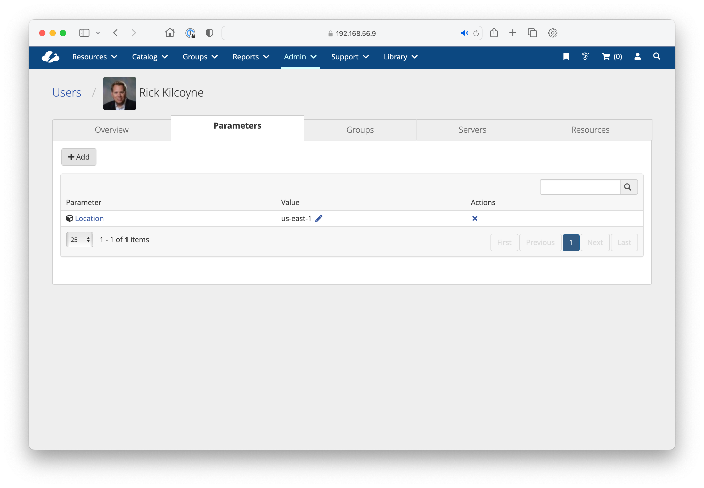

# EXERCISE: Creating and Attaching Custom Fields

## Use Case
A customer (Acme, Inc.) would like to track the approximate location of each User in CloudBolt so that later, they can make automated decisions about workload placement. To keep things simple, the range of values for this custom field will correspond to AWS regions. 

## Solution
Create a Custom Field that can be attached to users and queried in future scripts. Prefix the name of this field with `acme_` to separate it from CloudBolt parameters.

1. Start `shell_plus` on your CloudBolt instance.
2. Create a new Custom Field called `acme_location`:
   * 
   ```
   cf = CustomField.object.create(
      name="acme_location",
      type="STR",
      label="Location",
      show_as_attribute=True
   ) 
   ```
3. Attach this Custom Field to all existing users. User objects are not CloudBolt models, therefore we will attach this Custom Field to the corresponding UserProfile object accessed by the userprofile attribute:
   *
   ```
   for each user in User.objects.all():
     profile = user.userprofile
     profile.set_value_for_custom_field("acme_location", "us-east-1")
   ```
4. Note the new property in CloudBolt CMP, by going to `Admin > Users` and clicking the "Parameters" tab.
   
5. In `shell_plus`, fetch your user account and check for the existence of this new attribute:
   * Type: `profile = User.objects.get(username="rkilcoyne").userprofile` ↵
   * Use tab-completion to find "acme" attributes on profile typing `profile.acme` ⇥


